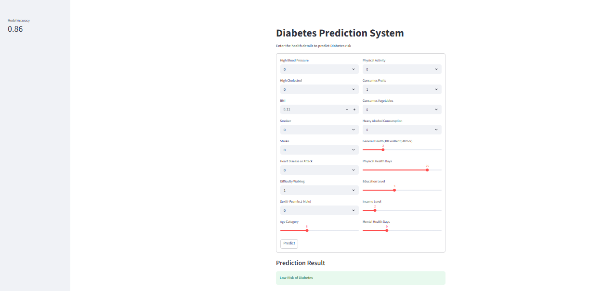

# Diabetes_predictionmodel

## Problem Statement
Diabetes is a common and serious health condition. Early detection can help in
better treatment and prevention.
This project aims to build a machine learning model that predicts the 
likelihood of diabetes based on medical attributes.

## Features
- Predicts diabetes based on user input
- Interactive UI using streamlit
- Automated model selection using AutoML
- Real-time prediction
- Clean and user-friendly interface

## Tech Stack
- Python
- Pandas, Numpy
- Scikit-learn/ FLAML(AutoML)
- Streamlit
- Git & Github

## Project Structure
project/
|
|--Deployment/
|       |--app.py
|      |__models/
|            |_____diabetes_model.pkl
|
|--src/
|   |--data_ingestion.py
|    |--data_preprocessing.py
|   |--model_building.py
|
|--assets/
|     |__Screenshot.png.png
|
|--data/
|    |__diabetes.csv
|
|--README.md

## Model Performance
- Accuracy: 85.5%
- Model selected using AutoML
- Balanced performance using optimized parameters

## Input Features
- Glucose
- BMI
- Age
- Sex
- Blood Pressure
- Insulin

## Deployment UI

## Author 
Khushi Rai
Aspiring Data Analyst/ Data Scientist
